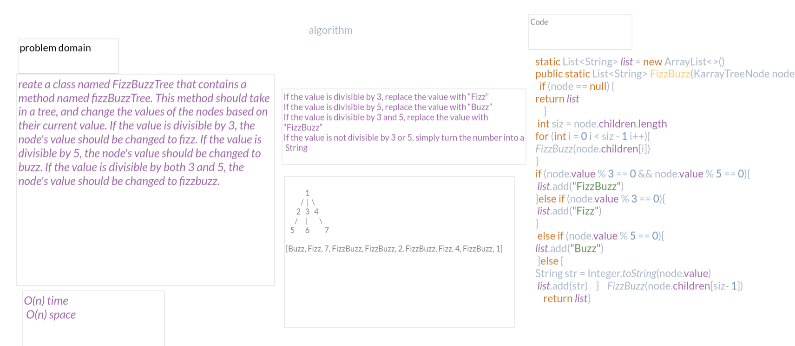

# Challenge Summary
### Create a class named FizzBuzzTree that contains a method named fizzBuzzTree. This method should take in a tree, and change the values of the nodes based on their current value. If the value is divisible by 3, the node's value should be changed to fizz. If the value is divisible by 5, the node's value should be changed to buzz. If the value is divisible by both 3 and 5, the node's value should be changed to fizzbuzz.
## Whiteboard Process
### O(n) time
### O(n) space
## Approach & Efficiency

## Solution

                   1
                /  |  \
               2   3   4
             / | \
            5  6  7

    [Buzz, Fizz, 7, FizzBuzz, FizzBuzz, 2, FizzBuzz, Fizz, 4, FizzBuzz, 1]