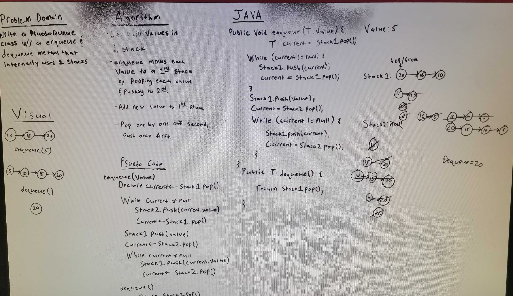
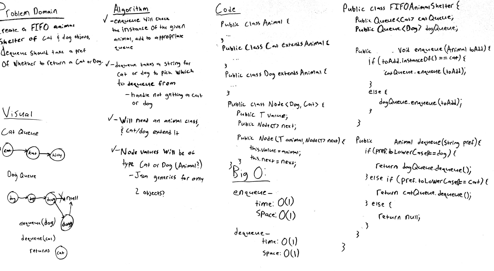
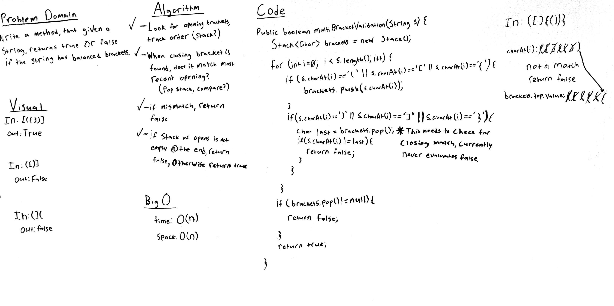

# Challenge Summary
## Implement a Pseudo Queue class that acts just like a Queue but operates internally using two stacks. It should include an enqueue and dequeue method that work under the first in first out basis.
## Whiteboard Process

## Approach & Efficiency
The Big O efficiency for this method is O(n) time and space.

## Solution
"NULL"
pseudoQueue.enqueue(1);
"[1]->NULL"
pseudoQueue.enqueue(2);
"[2]->[1]->NULL"
pseudoQueue.enqueue(3);
"[3]->[2]->[1]->NULL"
pseudoQueue.enqueue(4);
"[4]->[3]->[2]->[1]->NULL"
pseudoQueue.dequeue();
"[4]->[3]->[2]->NULL"

# Animal Shelter
## Challenge Summary

### Create a class called AnimalShelter which holds only dogs and cats. The shelter operates using a first-in, first-out approach. The shelter should have an enqueue(animal) method that will add either a cat or dog object to the shelter.

## Whiteboard Process

## Approach & Efficiency
time o(1)
space o(1)

# Challenge Summary
### Write a method named multiBracketValidation that, given a string, returns true or false if that string has balanced brackets ie: (){[]} returns true but ({[)]} returns false.
## Whiteboard Process

## Approach & Efficiency
time o(n)
space o(n)

## Solution
"{([])}" -> { -> ( ->[ -> null => -> { -> ( -> null => -> { -> null => null = > t
"([])}" ->  ( ->[ -> null => -> ( -> null => `}` = > f

