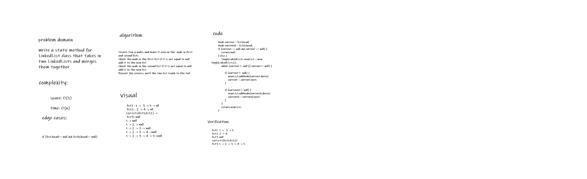

# Singly Linked Lists
### A LinkedList class and Node class. The LinkedList keeps track of what node is its head value, and each node contains its own value and a pointer to the node after it in the list.

## Challenge
### Create Node class and linked list class, and create (insert, include, to strin) methods inside linked list class.

## Approach & Efficiency

### * Time: O(n)
### * Space: O(1)

## API

### * insert Adds a new node with that value to the head of the list.

### * includes Indicates whether that value exists as a Node’s value somewhere within the list.

### * to string Returns: a string representing all the values in the Linked List, formatted as: "{ a } -> {

## Whiteboard Process

# Challenge Summary

### Write a method for your LinkedList class that takes in an integer k and returns the value from the kth node from the end of the list.

## Whiteboard Process

## Approach & Efficiency
### spaceO(1)
### timeO(n)

## Solution

### 1 -> 2 -> 3 -> 4 -> 5 // findKFromEnd(0) -> 5 findKFromEnd(3) -> 2  findKFromEnd(5) -> throw new IndexOutOfBoundsException("list Out Of Bounds") 

# Challenge Summary

## Write a static method for  LinkedList class that takes in two LinkedLists and merges them together

## Whiteboard Process

## Approach & Efficiency

### spaceO(1)
### timeO(n)## Solution

## Solution

### list1  1 ->  3 -> 5 list2 2 -> 4 / zipLists(list1,list2) -> list3 1 -> 2 -> 3 -> 4 -> 5